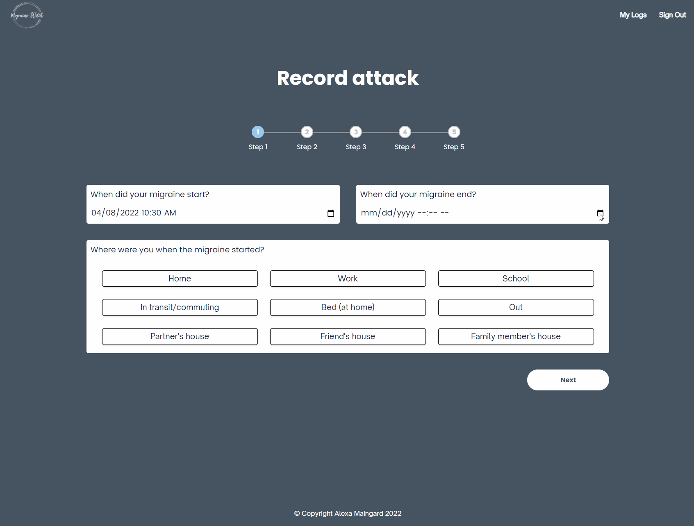
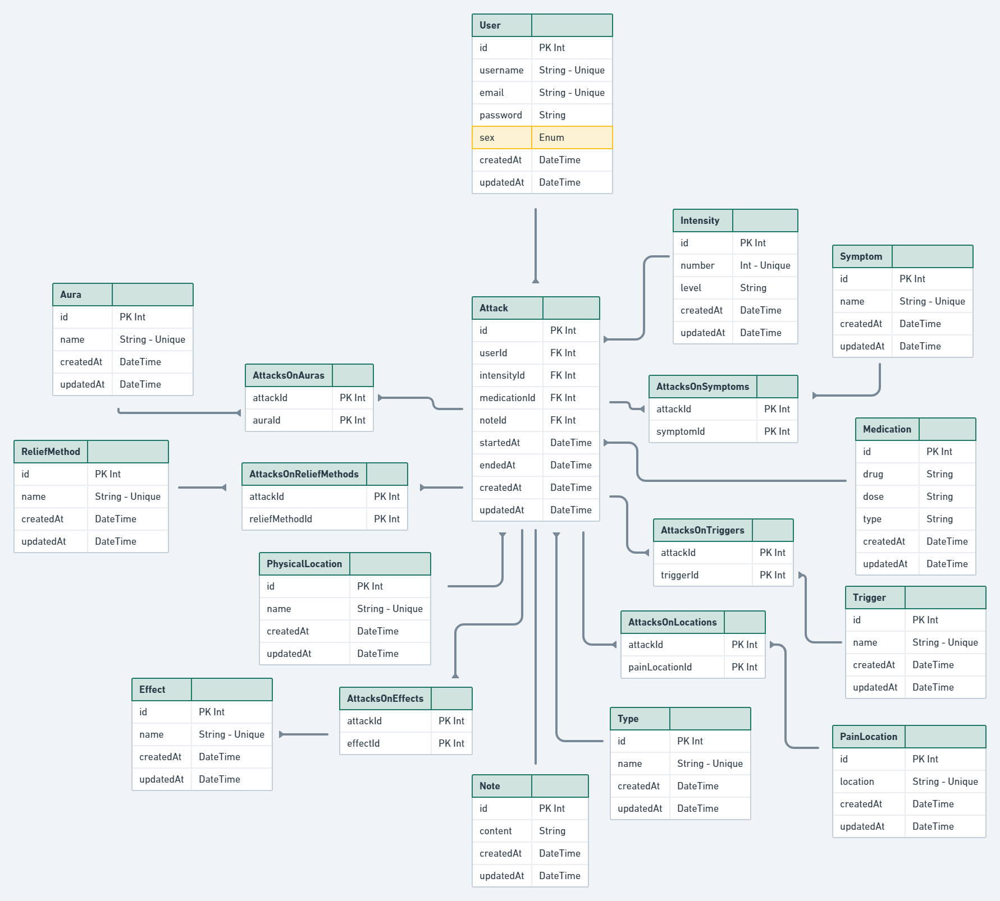

# Migraine Witch

Website App built in React/TypeScript using an Express server. Built in ≈ 9 days.

The main functionality of the app is to help you keep track of your migraine attacks.

## ERD

## How to use

You need to add an .env file with the following:

``

### Setting up

Clone the repo and execute the following:

<!-- Database and Prisma Setup Intructions here -->

- To install dependencies:
`npm ci`

### Intructions

Run the app with: 
`npm run devstart`